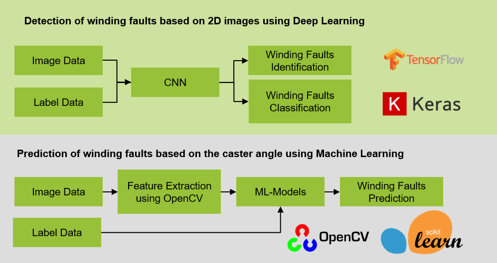
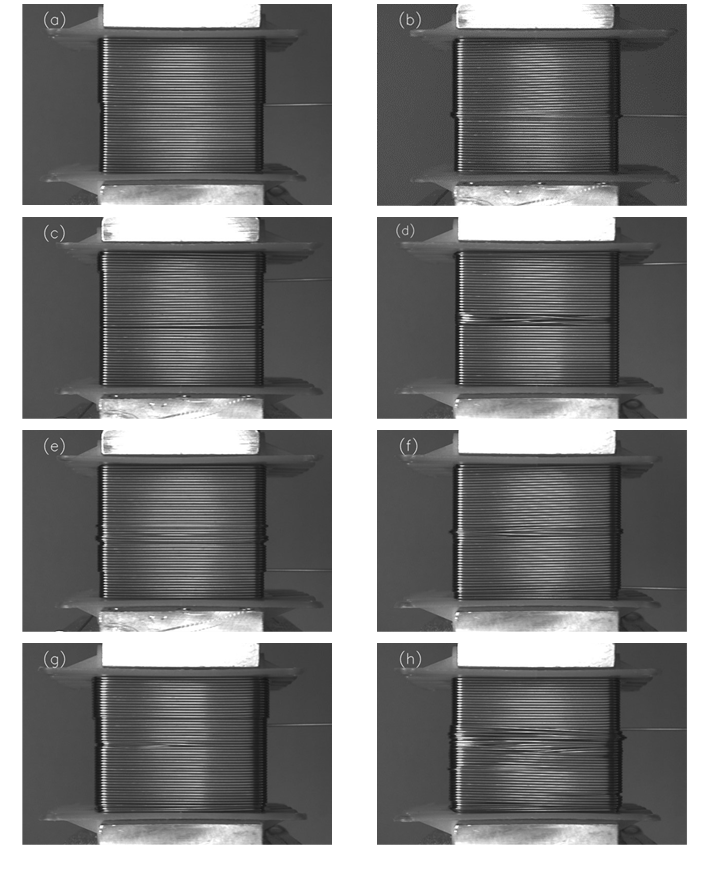
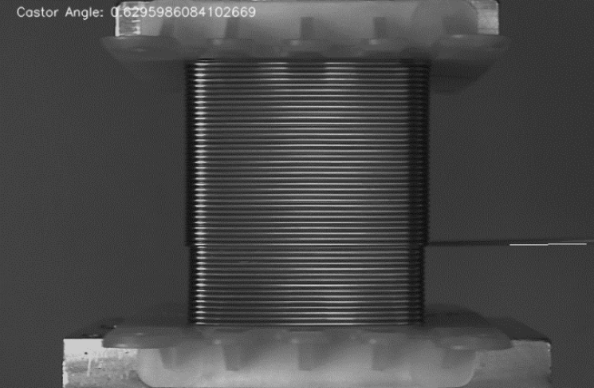
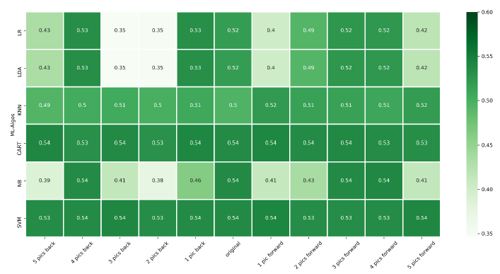
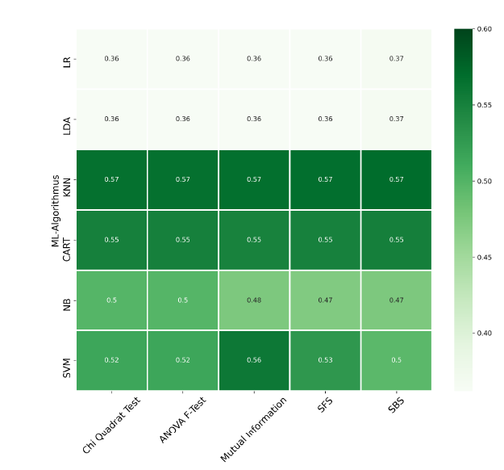

# A Winding Fault Detection System based on Deep Learning || Machine Vision

## Table of Contents

* [Project Description](#Project-Description)
* [Deep Learning Pipeline](#Deep-Learning-Pipeline)
    * [Dataset](#Dataset)
    * [Models](#Models)
    * [Performance](#Performance)
* [Machine Learning Pipeline based on classical image processing algorithms](#Machine-Learning-Pipeline-based-on-classical-image-processing-algorithms)
    * [Dataset](#Dataset)
    * [Models](#Models)

## Project Description

The project is part of my master thesis. In this project I demonstrated a PoC and built dozens of prototypes to validate
the **data-driven approaches** in quality monitoring for linear winding process, which represents a decisive step in the
production of electric motors.

The PoC should address:

1. to what extent the winding faults in production environment can be correctly **identified and classified** with CNNs
   and
2. whether the faults can be **predicted** by means of traditional computer vision techniques and machine learning
   algorithms.

The process can be divided into two steps.

During the first step I selected and annotated a dataset consisting of 38400 images from more than half a million raw
images, which were captured in the former work.

The second step includes the following:

* **Deep Learning Pipeline:** I developed and evaluated a winding fault detection system based on 3 types of CNNs
  through transfer learning
* **Machine Learning Pipeline based on classical image processing algorithms:** I built a engine to detect caster angles
  from original 2D images with OpenCV. After processing the extracted values the dataset was tested with six
  ML-algorithms.

## Deep Learning Pipeline

### Dataset

#### Image Data

The original images were captured in the true winding process. The whole image dataset consists of 672000 images, from
which I selected and annotated approximately 38100 images to build the training dataset. The images are shown below:

#### Label Data

To meet the needs of different use cases, the images were annotated in **four forms**.

1. **The first approach**: transform to **binary classification problem**

| Label | Winding Fault |
| ------ | ------ |
| 0 | no fault |
| 1 | fault |

2. **The second approach**: transform to **multi-class classification problem**

*each image can be assigned only to a unique class*

| Label | Winding Fault |
| ------ | ------ |
| 0_iO | no fault |
| 1_DW | double winding |
| 2_Luecke | gap |
| 3_Kreuzung | crossover |
| 4_DW_&_Luecke | double winding + gap |
| 5_DW_&_Kreuzung | double winding + crossover |
| 6_Luecke_&_Kreuzung | gap + crossover |
| 7_DW_&_Luecke _&_Kreuzung | double winding + gap + crossover |

3. **The third and fourth approaches**: cast the models to **multi-label problem** and **multi-output classification
   problem**.

*each image can have several labels*

| Label | Winding Fault |
| ------ | ------ |
| 0_iO | no fault |
| 1_DW | double winding |
| 2_Luecke | gap |
| 3_Kreuzung | crossover |

**the images are shown below:**

|image|---|
|---|---|
|a.| no fault |
|b.| double winding |
|c.| gap |
|d.| double winding + gap |
|e.| double winding + crossover |
|f.| gap + crossover |
|g.| double winding + gap + crossover |

### Models

For fast prototyping I utilized pre-trained models through **transfer learning**
(e.g. **InceptionV3**, **VGG16** and **ResNet50**). Totally I built **3 pre-trained models * 4 forms = 12 DL models**
to evaluate the best best performance of CNNs. Some important hyperparameters of the models are shown below:

| Label Form | Loss Function | Optimizer | Metrics | Jupyter Nootebook |
| ------ | ------ | ------ | ------ | ------ |
| binary | BinaryCrossentropy  | RMSprop | BinaryAccuracy |[InceptionV3](0_DeepLearning_Pipeline/1_Code/InceptionV3_binaryClassification_v1.ipynb), [VGG16](0_DeepLearning_Pipeline/1_Code/VGG16_binaryClassification_v1.ipynb), [ResNet50](0_DeepLearning_Pipeline/1_Code/ResNet_binaryClassification_v1.ipynb) |
| multi-Class | CategoricalCrossentropy  | RMSprop | CategoricalAccuracy |[InceptionV3](0_DeepLearning_Pipeline/1_Code/InceptionV3_multiClassClassification_v1.ipynb), [VGG16](0_DeepLearning_Pipeline/1_Code/VGG16_multiClassClassification_v1.ipynb), [ResNet50](0_DeepLearning_Pipeline/1_Code/ResNet_multiClassClassification_v1.ipynb)|
| multi-label | BinaryCrossentropy | RMSprop | F1-Score |[InceptionV3](0_DeepLearning_Pipeline/1_Code/InceptionV3_multiLabelClassification_v3.ipynb), [VGG16](0_DeepLearning_Pipeline/1_Code/VGG16_multiLabelClassification_v1.ipynb), [ResNet50](0_DeepLearning_Pipeline/1_Code/ResNet_multiLabelClassification_v1.ipynb)|
| multi-output | BinaryCrossentropy | RMSprop | BinaryAccuracy |[InceptionV3](0_DeepLearning_Pipeline/1_Code/InceptionV3_MultioutputCalssification.ipynb), [VGG16](0_DeepLearning_Pipeline/1_Code/VGG16_multiOutputClassification_v1.ipynb), [ResNet50](0_DeepLearning_Pipeline/1_Code/Resnet50_Multioutput_Classification.ipynb)|

### Performance

| Label Form | Model Performance |
| ------ | ------ |
| binary | f1-score > 0.995 for all labels  |
| multi-Class | f1-score < 0.9 for some classes because of inbalanced dataset  |
| multi-label | f1-score > 0.99 for all labels |
| multi-output | f1-score > 0.99 for all labels |

## Machine Learning Pipeline based on classical image processing algorithms

### Dataset

I built an eigine with OpenCV using **traditional image processing algorithms** to extract the castor angle values (*In the below picture*) from the images. 
The castor angle values were fed into six ML-algorithms in form of one feature or multi features. I chose only the binary form for annotation.

### Models

After feature engineering, I used six machine learning classifiers to test the predictability of faults.

[Codes for angle detection and machine learning models](https://github.com/Rswcf/application-of-machine-learning-in-quality-monitoring-during-linear-winding-process/blob/master/1_MachineLearning_Pipeline/1_Code/CastorAngleDetection%26ML.ipynb)

### Performance

One-Feature Models:

Multi-Feature Models:

